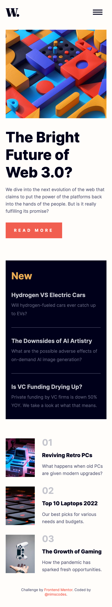

# Frontend Mentor - News homepage solution

This is a solution to the [News homepage challenge on Frontend Mentor](https://www.frontendmentor.io/challenges/news-homepage-H6SWTa1MFl). Frontend Mentor challenges help you improve your coding skills by building realistic projects. 

## Table of contents

- [Overview](#overview)
  - [The challenge](#the-challenge)
  - [Screenshot](#screenshot)
  - [Links](#links)
- [My process](#my-process)
  - [Built with](#built-with)
  - [Useful resources](#useful-resources)
- [Author](#author)
- [Acknowledgments](#acknowledgments)

## Overview

### The challenge

Users should be able to:

- View the optimal layout for the interface depending on their device's screen size
- See hover and focus states for all interactive elements on the page

### Screenshot

- Mobile View

- Desktop View

- Mobile Menu

### Links

- Solution URL: [Add solution URL here](https://your-solution-url.com)
- Live Site URL: [Add live site URL here](https://your-live-site-url.com)

## My process

### Built with

- Semantic HTML5 markup
- CSS custom properties
- Flexbox
- CSS Grid
- Mobile-first workflow
- Vanilla JavaScript

### Useful resources

- [Responsive navbar tutorial using HTML CSS & JS](https://www.youtube.com/watch?v=HbBMp6yUXO0) - This helped me to build a mobile menu for this challenge. I learnt some few tips in creating a responsive navigation bar and implementing assessbility techniques.

## Author

- Website - [Prince Andrews Nimako](https://nimscodes.vercel.app/)
- Frontend Mentor - [@nimscodes](https://www.frontendmentor.io/profile/nimscodes)

